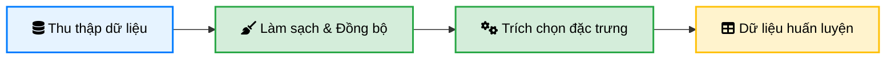

# Kế hoạch triển khai AI phát hiện rủi ro tàu cá

## Xác định nghiệp vụ
- Định nghĩa rủi ro
  - Thế nào là `Bình thường`, `Theo dõi`, `Rủi ro`, `Rủi ro cao`
- Xác định input, output của mô hình
- Xác định tiêu chí đánh giá:
  - Giảm thời gian kiểm tra
  - Tính chính xác của mô hình so với thực tế
  - ... **tùy nghiệp vụ**

## Pipeline xử lý data
### Các nguồn dữ liệu tiềm năng
- Dữ liệu nội bộ
- API, Web Service của các bộ ngành liên quan 
- Các dữ liệu bên ngoài: lịch sử thời tiết, danh sách đen,...
### Flow chung
- Thu thập dữ liệu từ các nguồn
- Làm sạch, đồng bộ thời gian và các trường dữ liệu, chuẩn hóa schema
- Trích chọn các trường dữ liệu cần thiết 
  - Đặc tính tĩnh của tàu: Tuổi tàu, công suất máy, loại ngư cụ đăng ký, lịch sử công ty sở hữu.
  - Đặc tính động của hành trình: Tần suất tắt/bật AIS, thời gian trung bình của chuyến đi, khu vực hoạt động thường xuyên, số ngày trên biển so với lượng cá báo cáo.
  - Đặc tính về con người & pháp lý: Lịch sử vi phạm của chủ tàu/thuyền trưởng, số lượng lao động so với đăng ký, tần suất thay đổi thuyền viên.
  - ... **tùy nghiệp vụ**
- Tạo dữ liệu huấn luyện

## Xây dựng mô hình
### Mục tiêu
#### 1. Mô hình phân loại theo nhãn  (Bình thường / Theo dõi / Rủi ro / Rủi ro cao)
#### 2. Mô hình phát hiện bất thường

### Flow tổng thể
